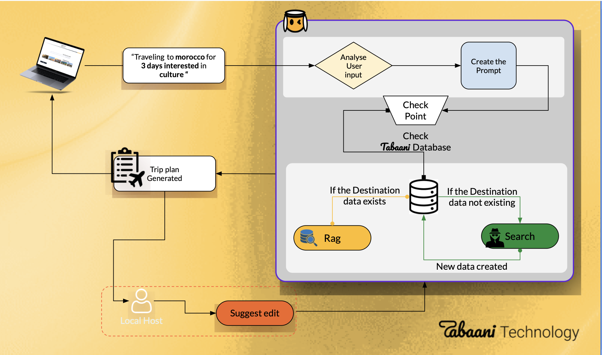
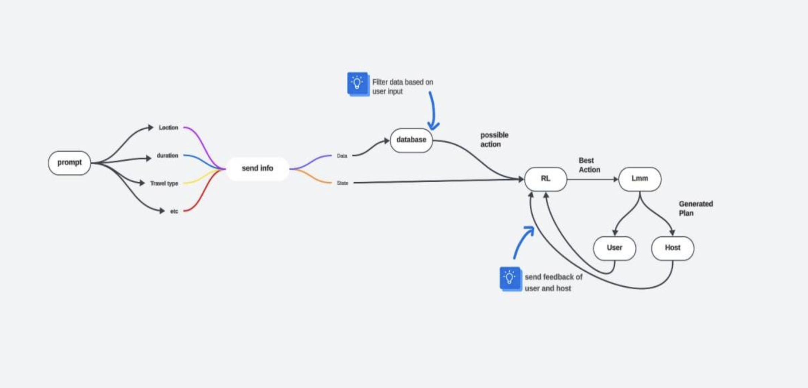

# Travel Plan Recommendation System (Tabaani Internship Project)

## About Tabaani

**Tabaani** is a leading travel and leisure tech platform curating authentic experiences and services anytime, anywhere across the Mediterranean.
They connect travelers with passionate local experts, satisfying their curiosity for adventure through joyful, meaningful moments.

---
## 📚 Table of Contents
- [Project idea & main workflow](#project-idea)
- [model 2 workflow](#model-2-workflow)  
- [google agent](#google-agent)  
- [google agent final output](#example-final-output)  
- [youtube agent](#youtube-agent) 
- [Project files Structure](#project-structure)
- [Run Locally](#run-locally)  
- [Run with Docker](#run-with-docker)  
- [future work](#future-work)
- [Author](#author)  


## Project Idea

This project is about building a **full pipeline** to automatically collect and process travel data in order to create a **recommendation system model**.
The system generates detailed travel plans tailored to user preferences.

---

## Main Workflow



The system consists of **two models**:

* **Model 1 (RAG-based)** – used if destination data already exists in the database.
* **Model 2 (Search-based)** – used if destination data is missing.

### Flow:

1. The user answers **6 survey questions** to set preferences.
2. A prompt is created based on the survey.
3. If destination data exists in the database → **Model 1** generates the plan.
4. If destination data does not exist → **Model 2** is triggered.
5. **Model 2** includes two agents:

   * **Google Agent**
   * **YouTube Agent**
6. Finally, the generated plan is **reviewed by a travel host at Tabaani**, who suggests edits and confirms the final plan.

---

## Model 1 Workflow



Model 1 is triggered **only when destination data is available in the database.**

**Steps:**

* **Input Prompt**: The user provides location, duration, travel type, and other details.
* **Data Processing**: Input is used to filter relevant data from the database.
* **Action Determination**: Reinforcement Learning (RL) identifies the best possible action based on filtered data and system state.
* **Plan Generation**: The best action is passed to a Large Language Model (LLM) to generate a detailed plan.
* **Feedback Loop**: The plan is sent to the user and host. Their feedback refines future results.

---

## My Main Internship Work

During the **3-month internship**, my main task was preparing **Model 2** (Google and YouTube agents).

---

## Model 2 Workflow

### Survey

The user answers a **6-question survey**:

1. Destination country.
2. Cities within the country (multiple allowed).
3. Start and end travel dates.
4. Interests (e.g., historical sites, adventure activities).
5. Travel companions (e.g., family, partner).
6. Budget type (e.g., budget-friendly, luxury).

Responses are stored in a **CSV file**, then converted into prompts or search keywords.

---

### Google Agent

* Uses the generated prompt to search for **travel blogs, trusted articles, and other resources**.
* Performs **web scraping** to extract activities and locations for the plan.
* For testing, we used **Gemini 2.0 Flash model** to generate sample plans.
* After generation, we applied **data cleaning** and **NLP techniques** to extract structured information and store it in the database.

**Steps:**

1. Save the generated plan in a `.txt` file.
2. Clean the text (remove special characters and stop words).
3. Extract activities using **spaCy’s `en_core_web_sm` model**:

   * Break text into sentences.
   * Identify activity-related keywords (visit, explore, dine, hike, etc.).
   * Extract **verbs** (actions) and **noun phrases** (places, food, objects).
   * Combine them into activity descriptions.
4. Return a **list of clean activity sentences**.

---

### Example Data (Before Cleaning)

*(excerpt)*

```
**Day 1: Arrival in Casablanca & Coastal Charm**

*   **Morning (9:00 AM):**
    *   **Arrival at Casablanca's Mohammed V International Airport (CMN).**
    *   **Private Transfer:** Be greeted by a private driver and transferred to your luxury hotel. (Sofitel Casablanca Tour Blanche, Four Seasons Hotel Casablanca)
    *   **Check-in and Refresh:** Settle into your accommodations and take some time to relax.
*   **Afternoon (12:00 PM):**
    *   **Lunch at Rick's Café:** Enjoy a memorable lunch at the iconic Rick's Café, inspired by the film "Casablanca." (Reservations are essential).
*   **Afternoon (2:00 PM):**
    *   **Hassan II Mosque Tour:** A guided tour of the magnificent Hassan II Mosque, one of the largest mosques in the world.  Its stunning architecture and oceanfront location are breathtaking.  Book a private guide for a more personalized experience.
*   **Evening (6:00 PM):**
    *   **Corniche Stroll:** Take a leisurely walk along the Corniche (coastal promenade), enjoying the ocean breeze and the vibrant atmosphere.
*   **Evening (8:00 PM):**
    *   **Dinner at Le Cabestan - Ocean View:** Enjoy a fine-dining experience with stunning ocean views at Le Cabestan.  They specialize in seafood and Moroccan cuisine.

**Day 2: Casablanca History & Marrakech Arrival**

*   **Morning (9:00 AM):**
    *   **Jewish Heritage Tour:** Explore Casablanca's Jewish heritage with a visit to the Museum of Moroccan Judaism, one of the only museums dedicated to Jewish history in the Arab world. Also visit the Beth-El Temple, the largest temple in Casablanca.
*   **Morning (11:00 AM):**
    *   **Old Medina Exploration:** Wander through the charming, less-touristed Old Medina of Casablanca.  It offers a more authentic glimpse into local life.
*   **Afternoon (1:00 PM):**
    *   **Lunch at a Local Restaurant:** Enjoy a traditional Moroccan lunch at a restaurant in the Medina (e.g., *Restaurant Al Mounia* for a mix of Moroccan and French cuisine).
*   **Afternoon (3:00 PM):**
    *   **Private Transfer to Marrakech:** Enjoy a comfortable private transfer to Marrakech (approximately 3-4 hours).  Your driver will ensure a smooth and scenic journey.
*   **Evening (6:00 PM):**
    *   **Check-in to Luxury Riad:** Arrive in Marrakech and check into your luxury riad in the Medina (e.g., Royal Mansour Marrakech, La Mamounia, Riad Kniza). A riad offers a more intimate and authentic Moroccan experience.
*   **Evening (8:00 PM):**
    *   **Riad Dinner:** Enjoy a delicious welcome dinner at your riad.  Many riads offer exceptional culinary experiences.
```


---

### Example Output (After Extraction)

```python
[
 'guide start afternoon embark a private guided tour casablanca',
 'explore bustle its charming alleyways vibrant souks',
 'indulge inspire a delightful dinner ricks café',
 'enjoy soak visit a leisurely stroll the royal palace',
 'experience bike the thrill quad the scenic dunes'
]
```

---

## Extracting Locations

### Previous Approach: Using BERT NER Pipeline
At the beginning of the internship, we experimented with using a pre-trained BERT-based NER model (dslim/bert-base-NER) from Hugging Face to extract locations.

#### example results
```
{'activity': 'Explore the charming medieval village visit a vineyard for a wine tasting and enjoy a picnic lunch in the vineyards', 
 'location': None}

{'activity': 'Afternoon Return to Bordeaux and enjoy a final meal at a local restaurant', 
 'location': 'Bordeaux'}

{'activity': 'Food Look for formule menus at restaurants explore street food markets and pack your own picnic lunches', 
 'location': None}

{'activity': 'Activities Take advantage of free walking tours museums with free admission on certain days and explore local parks and gardens', 
 'location': None}

```

### Improved Approach: LocationTagger
To improve accuracy, I switched to using locationtagger, which is built on top of spaCy’s NER. Unlike the BERT-based pipeline, locationtagger not only detects raw entities but also classifies them into structured categories (e.g., country, city, region, landmark).


**LocationTagger**, is a library built on top of **spaCy’s Named Entity Recognition (NER)**.

### Why NER?

NER (Named Entity Recognition) is an **NLP technique** that identifies predefined categories of text such as names, places, and organizations.

Instead of manually writing rules, **LocationTagger** provides:

* Accurate detection of geographic names.
* Structured outputs (lists of cities, countries, landmarks).
* Easy integration with other parts of the pipeline.

### How LocationTagger Works

* Uses spaCy’s **machine learning NER model** to detect raw location entities.
* Applies **rule-based lookups** to organize them into categories like countries, cities, and landmarks.

which made the extraction process much more reliable, consistent, and structured, which was crucial for generating clean travel plan data.


#### example output after using location tagger

```
{'activity': "explore showcase Afternoon the designer's fascination Moroccan culture his iconic designs", 'countries': [], 'regions': [], 'cities': [], 'other': ['the Yves Saint Laurent Museum', 'Moroccan', 'Yves Saint Laurent Museum']}

{'activity': 'enjoy surround Day Embark a thrilling hot air balloon ride the vast expanse breathtaking views the surrounding landscapes', 'countries': [], 'regions': [], 'cities': [], 'other': ['the Sahara Desert', 'Marrakech Adventure', 'Luxury Morning Embark', 'Sahara Desert']}

{'activity': 'enjoy renowne a delicious dinner a legendary hotel its exquisite cuisine atmosphere', 'countries': [], 'regions': [], 'cities': [], 'other': ['La Mamounia']}
```

#### Results was approximatly **70%** better as before 
---

## Combined Extraction

Finally, we built a function that extracts **both activities and locations**.

### Example Final Output

```markdown
Country: Morocco  
Activity: Visit marvel the iconic Hassan II Mosque  
Cities: Casablanca  
Places: Hassan II Mosque  
Budget: Luxury  
```

---

## Saving Results

The structured results are stored in a **CSV database file**.

### Example CSV

| Country | Activity                         | Location                 | Budget |
| ------- | -------------------------------- | ------------------------ | ------ |
| Morocco | Delightful dinner at Rick’s Café | Casablanca, Rick’s Café  | Luxury |
| Morocco | Guided tour of Djemaa el-Fna     | Marrakech, Djemaa el-Fna | Luxury |
| Morocco | High-speed train to Marrakech    | Marrakech, Medina        | Luxury |

---

## YouTube Agent

Another way to gather data is through **YouTube transcripts**.
The idea is to extract the same structured information (activities, locations, budget) from travel vlog transcripts.


## Project Structure

📂 **travel-plan-recommendation-system**  
 ┣ 📜 **google_agent_database.py** – Handles Google search queries and data extraction.  
 ┣ 📜 **youtube_agent_database.py** – Fetches travel-related content and insights from YouTube.  
 ┣ 📜 **for_prompt.csv** – Stores user survey answers for generating personalized plans.  
 ┣ 📜 **plan.txt** – Contains raw scraped text or Gemini-generated travel suggestions.  
 ┣ 📜 **database.csv** – Final output file storing the recommended travel plan.  
 ┣ 📜 **requirements.txt** – Lists Python dependencies for the project.  
 ┣ 📜 **Dockerfile** – Configuration file to build and run the project inside a Docker container.  
 ┣ 📜 **README.md** – Documentation and instructions for the project.  
 


## How to Run Locally (without Docker)
## Run locally

1. Create virtual environment:
   ```bash
   python -m venv .venv
   source .venv/bin/activate   # Mac/Linux
   .venv\Scripts\activate 
     # Windows

2. Install dependencies:
```bash
pip install -r requirements.txt
Run the script:
python main.py
```

3. Run the script:
``` bash
python google_agent_database.py
python youtube_agent_database.py
```


---

### 4. **How to Run with Docker**

1. Build the Docker image:

```bash
   docker build -t travel-plan-recommendation-system .
```

2. Run the container:
```bash
docker run --rm travel-plan-recommendation-system
```

## Future work 
1. continue working on web scraping and not rely on gemini 
2. building a tiktok agent that collects data from tiktok reels transcripts 
3. improve the extracting activity method 
4. build a machine learning model to predict average prices for each location and activity 
5. building the recommendation travel plan system using collected data 


#### Made with ❤️ by Toka Mohamed  
